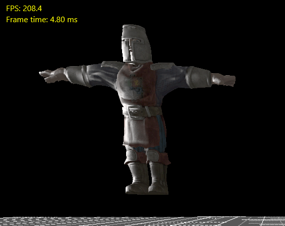
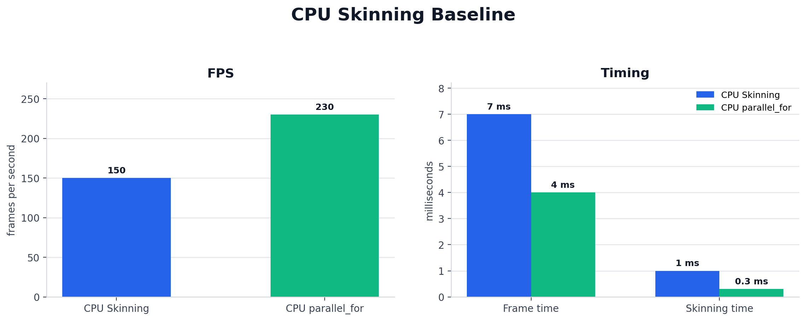

# Week10 - CPU Linear Blend Skinning

Week10에서는 FBX 기반 skeletal mesh를 엔진에 올리고, bone index / weight 기반 CPU Linear Blend Skinning을 구현했다. 이 작업은 이후 Week11 GPU Skinning으로 넘어가기 위한 correctness baseline이자, vertex 단위 병렬 처리 가능성을 확인한 기준점이다.




CPU Skinnig(상), CPU parallel_for Skinning(하)의 비교 이미지

## Goal

- FBX에서 가져온 skeletal mesh의 vertex를 bone transform에 맞춰 변형한다.
- 각 vertex의 최대 4개 bone influence를 이용해 position, normal, tangent를 계산한다.
- normal / tangent를 정규화하고 tangent basis를 보정해 lighting 결과를 유지한다.
- CPU skinning을 `concurrency::parallel_for`로 병렬화해 vertex 단위 독립 연산의 성격을 확인한다.

## Pipeline Overview

```text
FBX Skeletal Mesh
    |
    v
Bone Hierarchy / Bind Pose / Skin Weight
    |
    v
Skinning Matrix
    |
    v
CPU Linear Blend Skinning
    |
    +-- Position transform
    +-- Normal transform
    +-- Tangent transform
    +-- Gram-Schmidt tangent correction
    |
    v
Animated Vertex Buffer
```

## CPU Linear Blend Skinning

CPU skinning은 각 vertex가 가진 `BoneIndices[4]`, `BoneWeights[4]`를 순회하면서 bone별 변환 결과를 weight로 누적한다. 이때 각 vertex는 자기 입력 데이터와 skinning matrix만 읽고, 자기 출력 슬롯에만 기록하므로 병렬화하기 좋은 구조다.

```cpp
AnimatedVertices.Empty();
AnimatedVertices.SetNum(VertexCount);
concurrency::parallel_for(0, VertexCount, [&](uint32 i)
{
    const FSkinnedVertex& SourceVertex = MeshAsset->SkinnedVertices[i];
    FNormalVertex& AnimatedVertex = AnimatedVertices[i];

    AnimatedVertex.pos = {};
    AnimatedVertex.normal = {};
    AnimatedVertex.Tangent = {};

    float TangentW = SourceVertex.BaseVertex.Tangent.W;
    FVector Tangent3 = {};

    for (int j = 0; j < 4; j++)
    {
        int BoneIndex = SourceVertex.BoneIndices[j];
        float BoneWeight = SourceVertex.BoneWeights[j];

        if (BoneWeight <= KINDA_SMALL_NUMBER || BoneIndex >= SkinningMatrix.Num() || BoneIndex < 0)
        {
            continue;
        }

        FVector Pos = SourceVertex.BaseVertex.pos * SkinningMatrix[BoneIndex];
        FVector4 Normal4 = TransformDirection(SourceVertex.BaseVertex.normal, SkinningInvTransMatrix[BoneIndex]);
        FVector Normal = FVector(Normal4.X, Normal4.Y, Normal4.Z);
        FVector4 Tangent = TransformDirection(SourceVertex.BaseVertex.Tangent, SkinningMatrix[BoneIndex]);

        AnimatedVertex.pos += BoneWeight * Pos;
        AnimatedVertex.normal += BoneWeight * Normal;
        Tangent3 += BoneWeight * FVector(Tangent.X, Tangent.Y, Tangent.Z);
    }

    AnimatedVertex.normal.Normalize();
    Tangent3.Normalize();

    float Scalar = FVector::Dot(AnimatedVertex.normal, Tangent3);
    Tangent3 = (Tangent3 - (Scalar * AnimatedVertex.normal)).GetSafeNormal();
    AnimatedVertex.Tangent = FVector4(Tangent3, TangentW);
});
```

핵심은 position만 변환하는 것이 아니라, lighting에 필요한 normal과 tangent까지 같은 skinning 흐름에서 처리했다는 점이다.

## Normal and Tangent Handling

normal은 position처럼 translation을 포함하면 안 되므로 방향 벡터로 변환한다. tangent도 방향 벡터로 변환하고, `Tangent.w`에는 bitangent 방향 sign을 보존한다.

```cpp
FVector4 Normal4 = TransformDirection(SourceVertex.BaseVertex.normal, SkinningInvTransMatrix[BoneIndex]);
FVector Normal = FVector(Normal4.X, Normal4.Y, Normal4.Z);
FVector4 Tangent = TransformDirection(SourceVertex.BaseVertex.Tangent, SkinningMatrix[BoneIndex]);

AnimatedVertex.normal += BoneWeight * Normal;
Tangent3 += BoneWeight * FVector(Tangent.X, Tangent.Y, Tangent.Z);
```

누적된 tangent는 normal에 대해 Gram-Schmidt 방식으로 직교화한다.

```cpp
AnimatedVertex.normal.Normalize();
Tangent3.Normalize();

float Scalar = FVector::Dot(AnimatedVertex.normal, Tangent3);
Tangent3 = (Tangent3 - (Scalar * AnimatedVertex.normal)).GetSafeNormal();
AnimatedVertex.Tangent = FVector4(Tangent3, TangentW);
```

이 보정은 normal mapping에서 TBN basis가 무너지는 것을 줄이기 위한 처리다.

## CPU parallel_for Baseline

`concurrency::parallel_for`를 사용한 이유는 CPU skinning도 가능한 범위에서 최적화한 뒤 GPU skinning과 비교하기 위해서다.

- 각 vertex는 독립적으로 계산된다.
- input vertex와 skinning matrix는 read-only로 참조한다.
- output은 `AnimatedVertices[i]`에만 기록한다.
- vertex 간 의존성이 없어 lock이나 critical section이 필요하지 않다.

따라서 CPU thread 병렬화는 skinning의 병렬 처리 가능성을 보여주는 중간 단계였다. 다만 skeletal mesh 수와 vertex 수가 늘어나면 CPU에서 skinned vertex buffer를 계속 갱신해야 하므로, 최종적으로는 GPU skinning이 더 적합한 구조다.

## Measurements

측정 조건: skeletal mesh 1개, animation 없이 T-pose 상태, 당시 dirty flag가 없어 매 프레임 skinning이 계속 수행되는 상태로 측정했다.



| Path | FPS | Frame time | Skinning time |
|------|-----|------------|---------------|
| CPU Skinning | 150 FPS | 7.0 ms | 1.0 ms |
| CPU parallel_for Skinning | 230 FPS | 4.0 ms | 0.3 ms |

해석:

- CPU skinning은 vertex 단위 독립 연산이라 CPU thread 병렬화만으로도 개선이 가능했다.
- `parallel_for` 적용으로 skinning 연산 시간이 `1.0 ms`에서 `0.3 ms`로 감소했다.
- 하지만 CPU에서 vertex buffer를 매 프레임 갱신하는 구조는 mesh 수와 vertex 수가 늘어날수록 부담이 커진다.
- 이 결과는 Week11 GPU Skinning으로 넘어가는 근거가 되었다.

## Result & Learning

### Result

- FBX skeletal mesh의 bone index / weight 기반 CPU LBS를 구현했다.
- position, normal, tangent를 함께 변환해 skeletal mesh lighting에 필요한 vertex data를 유지했다.
- `concurrency::parallel_for`로 vertex 단위 CPU skinning을 병렬화했다.
- tangent Gram-Schmidt 보정으로 normal/tangent basis의 직교성을 보완했다.
- CPU skinning baseline을 통해 GPU skinning으로 이전할 기준 성능을 확보했다.

### Learning

- Skinning은 vertex별 입력/출력이 독립적이므로 데이터 병렬 처리에 적합하다.
- CPU 병렬화로도 개선은 가능하지만, CPU가 skinned vertex buffer를 계속 갱신하는 구조는 확장성이 제한된다.
- position뿐 아니라 normal, tangent, tangent sign까지 함께 처리해야 normal mapping과 lighting 결과가 유지된다.
- CPU LBS는 GPU skinning 결과를 검증하기 위한 correctness baseline으로 유용하다.

## Source References

- `Week10/Mundi/Source/Runtime/Engine/Components/SkinnedMeshComponent.cpp`
  - `PerformCPUSkinning`
  - `concurrency::parallel_for`
  - position / normal / tangent LBS
  - per-vertex tangent Gram-Schmidt correction
- `Week10/Mundi/Source/Runtime/Engine/Components/SkeletalMeshComponent.cpp`
  - skeletal mesh update path
  - CPU skinning invocation
- `Week10/Mundi/Source/Runtime/AssetManagement`
  - FBX skeletal mesh import / bake data
