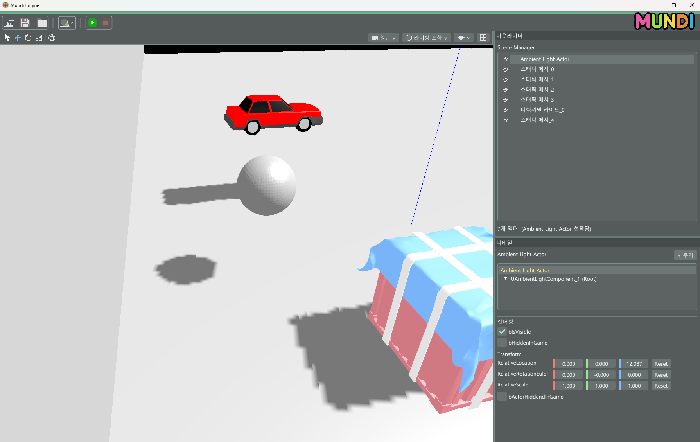
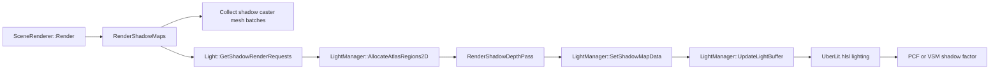
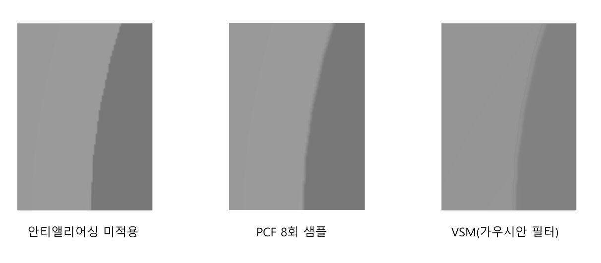

# Week08 - Shadow Mapping / PCF / VSM

Direct3D 11 기반 custom engine에서 SpotLight shadow map을 생성하고, scene lighting 단계에서 PCF / VSM filtering으로 그림자 품질을 비교한 작업이다. Week08의 shadow system은 Directional / Point / Spot light 경로를 함께 포함하지만, 이 문서에서는 개인 담당 범위였던 SpotLight Shadow Mapping과 PCF / VSM filtering 위주로 정리한다.

> 개인 담당 범위: SpotLight Shadow Map, PCF, VSM filtering  
> `Shadow Pass`와 `Shadow Atlas`는 해당 작업이 엔진 렌더링 파이프라인에 연결되는 구조를 설명하기 위한 context로 정리했다.



## Goals

- SpotLight 기준의 `ViewMatrix` / `ProjectionMatrix`와 shadow render request 구성
- SpotLight shadow map을 lighting shader에서 샘플링해 그림자 적용
- PCF와 VSM을 shader macro로 분기해 shadow edge 품질 비교
- ImGui editor setting에서 PCF / VSM technique을 전환할 수 있도록 연결
- Shadow pass / atlas는 SpotLight shadow map이 엔진에 연결되는 흐름 이해용으로 설명

## Pipeline



렌더링 흐름은 shadow pass와 lighting pass로 나뉜다. Shadow pass에서는 light 시점으로 caster mesh를 렌더링하고, lighting pass에서는 world position을 light-space UV로 변환한 뒤 shadow atlas를 샘플링한다.

## SpotLight Shadow Request

SpotLight는 자신의 world transform으로 light view/projection matrix를 만들고, shadow atlas에 넣을 render request를 생성한다. 이 request는 renderer가 shadow pass를 돌릴 때 viewport, matrix, sample count를 설정하는 기준 데이터가 된다.

```cpp
void USpotLightComponent::GetShadowRenderRequests(
    FSceneView* View, TArray<FShadowRenderRequest>& OutRequests)
{
    FShadowRenderRequest ShadowRenderRequest;
    ShadowRenderRequest.LightOwner = this;
    ShadowRenderRequest.ViewMatrix = GetViewMatrix();
    ShadowRenderRequest.ProjectionMatrix = GetProjectionMatrix();
    ShadowRenderRequest.WorldLocation = GetWorldLocation();
    ShadowRenderRequest.Radius = GetAttenuationRadius();
    ShadowRenderRequest.Size = ShadowResolutionScale;
    ShadowRenderRequest.SubViewIndex = 0;
    ShadowRenderRequest.SampleCount = SampleCount;
    OutRequests.Add(ShadowRenderRequest);
}
```

`GetProjectionMatrix()`는 SpotLight의 `OuterConeAngle`을 기반으로 perspective projection을 만들고, `GetLightInfo()`에서는 `ShadowViewProjMatrix`, `SampleCount`, light position을 shader용 `FSpotLightInfo`에 담는다.

## Shadow Atlas Context

SpotLight shadow map은 엔진의 2D shadow atlas 구조에 배치된다. 이 섹션은 개인 담당 기능이 어떤 resource 구조에 연결되는지 설명하기 위한 context다. Week08 shadow pipeline에서는 2D shadow atlas를 `DXGI_FORMAT_R24G8_TYPELESS` texture로 만들고, depth write용 DSV와 shader read용 SRV를 따로 생성한다. VSM은 depth가 아니라 moment 값을 저장해야 하므로 `DXGI_FORMAT_R32G32_FLOAT` render target / shader resource를 별도로 둔다.

```cpp
// Depth shadow atlas
TexDesc.Format = DXGI_FORMAT_R24G8_TYPELESS;
TexDesc.BindFlags = D3D11_BIND_DEPTH_STENCIL | D3D11_BIND_SHADER_RESOURCE;
dsvDesc.Format = DXGI_FORMAT_D24_UNORM_S8_UINT;
srvDesc.Format = DXGI_FORMAT_R24_UNORM_X8_TYPELESS;

// VSM atlas
VSMDesc.Format = DXGI_FORMAT_R32G32_FLOAT;
VSMDesc.BindFlags = D3D11_BIND_RENDER_TARGET | D3D11_BIND_SHADER_RESOURCE;
```

Atlas packing은 큰 shadow request부터 배치하는 shelf 방식으로 처리된다. SpotLight request는 atlas 내부의 viewport offset과 shader sampling에 필요한 `AtlasScaleOffset`을 받아 lighting shader에서 올바른 atlas 영역을 샘플링한다.

```cpp
Request.AtlasViewportOffset = FVector2D(CurrentAtlasX, CurrentAtlasY);
Request.AtlasScaleOffset = FVector4(
    Request.Size / (float)ShadowAtlasSize2D,
    Request.Size / (float)ShadowAtlasSize2D,
    CurrentAtlasX / (float)ShadowAtlasSize2D,
    CurrentAtlasY / (float)ShadowAtlasSize2D
);
```

## Shadow Pass Context

`RenderShadowMaps()`는 SpotLight shadow map이 실제로 생성되는 엔진 측 연결 지점이다. Shadow caster mesh batch를 수집한 뒤 light별 request를 받아 shadow atlas에 depth를 렌더링하고, PCF / VSM technique에 따라 render target과 pixel shader 경로를 다르게 선택한다. PCF는 depth-only path를 사용하고, VSM은 pixel shader를 켜서 depth moment를 render target에 기록한다.

```cpp
switch (ShadowAAType)
{
case EShadowAATechnique::PCF:
    RHIDevice->OMSetCustomRenderTargets(0, nullptr, AtlasDSV2D);
    break;
case EShadowAATechnique::VSM:
    RHIDevice->OMSetCustomRenderTargets(1, &VSMAtlasRTV2D, AtlasDSV2D);
    break;
}
```

```cpp
switch (ShadowAAType)
{
case EShadowAATechnique::PCF:
    RHIDevice->GetDeviceContext()->PSSetShader(nullptr, nullptr, 0);
    break;
case EShadowAATechnique::VSM:
    RHIDevice->GetDeviceContext()->PSSetShader(ShaderVarianVSM->PixelShader, nullptr, 0);
    break;
}
```

VSM pixel shader는 light position과 radius를 이용해 normalized depth를 구하고, `E(z)`와 `E(z^2)`를 `float2`로 저장한다.

```hlsl
float Distance = length(Input.WorldPosition - LightWorldPosition);
float NormalizedDepth = saturate(Distance / LightRadius);
float Moment1 = NormalizedDepth;
float Moment2 = NormalizedDepth * NormalizedDepth;

return float2(Moment1, Moment2);
```

## PCF / VSM Filtering

Lighting shader는 render setting을 기반으로 `SHADOW_AA_TECHNIQUE` macro를 추가하고, `UberLit.hlsl`에서 `g_ShadowAtlas2D`와 `g_VSMShadowAtlas`를 샘플링한다.

```cpp
if (Technique == EShadowAATechnique::PCF)
{
    ShaderMacros.Add(FShaderMacro("SHADOW_AA_TECHNIQUE", "1"));
}
else if (Technique == EShadowAATechnique::VSM)
{
    ShaderMacros.Add(FShaderMacro("SHADOW_AA_TECHNIQUE", "2"));
}
```

```hlsl
#if SHADOW_AA_TECHNIQUE == 1
    float shadowFactor = CalculateSpotLightShadowFactor(
        worldPos, light.ShadowData, ShadowMap, ShadowSampler);
#elif SHADOW_AA_TECHNIQUE == 2
    float shadowFactor = CalculateSpotLightShadowFactorVSM(
        worldPos, light.ShadowData, light.AttenuationRadius, VShadowMap, VShadowSampler);
#endif
```

PCF는 hardware comparison sampler의 `SampleCmpLevelZero`를 여러 번 호출해 shadow edge를 평균낸다. `SampleCount`는 SpotLight component property로 노출되어 editor에서 0~16 범위로 조절할 수 있다.

VSM은 depth 비교 대신 moment texture를 샘플링하고, variance 기반 확률값으로 shadow factor를 계산한다. 필터링이 쉬워 부드러운 그림자 표현에 유리하지만 light bleeding 문제가 발생할 수 있어 `MinVariance` 보정이 필요하다.



## Editor Integration

Editor viewport menu에서 shadow anti-aliasing을 켜고, PCF / VSM radio button으로 filtering technique을 전환한다. 선택된 값은 `URenderSettings::ShadowAATechnique`에 저장되고, renderer가 shader variant macro와 shadow pass target 선택에 사용한다.

```cpp
ImGui::RadioButton(" PCF (Percentage-Closer Filtering)", &techniqueInt,
    static_cast<int>(EShadowAATechnique::PCF));

ImGui::RadioButton(" VSM (Variance Shadow Maps)", &techniqueInt,
    static_cast<int>(EShadowAATechnique::VSM));
```

## Result & Learning

- Shadow Mapping을 light-space render pass와 main lighting pass로 분리해 이해했다.
- D3D11에서 depth texture를 DSV/SRV로 함께 사용하기 위해 typeless format을 사용하는 이유를 확인했다.
- SpotLight shadow map이 shadow pass / atlas / lighting shader로 이어지는 렌더링 파이프라인에 어떻게 연결되는지 이해했다.
- PCF는 shadow edge 품질과 sample count 비용의 trade-off가 있고, VSM은 부드러운 filtering이 쉽지만 light bleeding 문제가 생길 수 있음을 비교했다.
- Render setting, shader macro, shader resource binding이 연결되어 runtime rendering feature toggle을 구성하는 흐름을 정리했다.

## Source References

| File | Role |
|------|------|
| `Source/Runtime/Engine/Components/SpotLightComponent.cpp` | SpotLight shadow request, light view/projection matrix, sample count |
| `Source/Runtime/Renderer/SceneRenderer.cpp` | Shadow map pass, PCF/VSM render target selection, shader macro injection |
| `Source/Runtime/Renderer/LightManager.h` | `FShadowRenderRequest`, `FShadowMapData`, shadow atlas resource declarations |
| `Source/Runtime/Renderer/LightManager.cpp` | 2D depth atlas, VSM atlas, atlas packing, shadow SRV binding |
| `Source/Runtime/Renderer/RenderSettings.h` | Shadow AA technique setting |
| `Source/Runtime/Core/Misc/Enums.h` | `EShadowAATechnique`, shadow show flags |
| `Source/Slate/Windows/SViewportWindow.cpp` | ImGui PCF/VSM selection UI |
| `Shaders/Shadows/DepthOnly_VS.hlsl` | Light-space depth pass vertex shader |
| `Shaders/Shadows/DepthOnly_PS.hlsl` | VSM moment output shader |
| `Shaders/Materials/UberLit.hlsl` | Shadow atlas and VSM texture binding |
| `Shaders/Common/LightingCommon.hlsl` | PCF / VSM shadow factor calculation |
