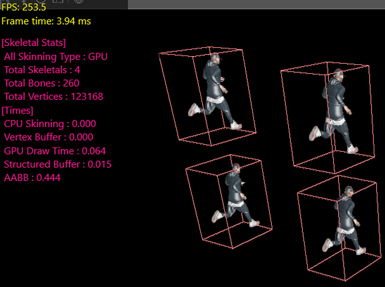
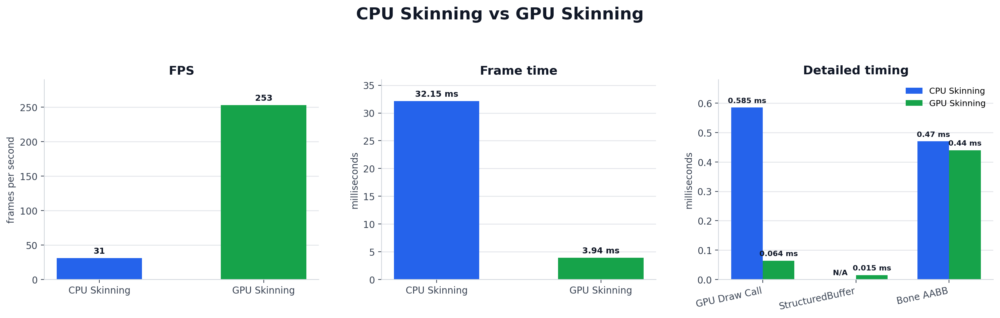

# Week11 - GPU Skinning, Profiling, and Bone AABB

Week11에서는 Week10의 CPU Linear Blend Skinning baseline을 GPU skinning path로 확장했다. CPU는 animation pose에서 계산된 bone matrix를 `StructuredBuffer`로 업로드하고, vertex shader가 bone index / weight 기반 skinning을 수행하도록 변경했다. 또한 CPU/GPU profiler와 Bone AABB bounds를 이용해 병목과 trade-off를 확인했다.



## Goal

- CPU vertex skinning과 skinned vertex buffer upload 비용을 제거한다.
- bone matrix는 `StructuredBuffer`로 업로드하고, vertex 변환은 vertex shader에서 처리한다.
- `USE_GPU_SKINNING` shader macro로 static mesh path와 skinned mesh path를 분기한다.
- CPU/GPU profiler로 skinning, buffer upload, draw call 비용을 분리해 측정한다.
- Bone AABB로 모든 vertex를 다시 skinning하지 않고 conservative bounds를 계산한다.

## Pipeline Overview

```text
Animation Pose
    |
    v
FinalSkinningMatrices / FinalSkinningNormalMatrices
    |
    v
UpdateStructuredBuffer
    |
    v
VS SRV slots t12 / t13
    |
    v
Vertex Shader Skinning
    |
    +-- SkinPosition
    +-- SkinVector Normal
    +-- SkinVector Tangent
    |
    v
World Transform / TBN / Draw
```

## C++: StructuredBuffer Update

GPU path에서는 vertex buffer를 매 프레임 다시 쓰지 않는다. CPU는 bone matrix buffer만 갱신하고, vertex shader가 각 vertex를 변형한다.

```cpp
if (bForceGPUSkinning &&
   SkinningMatrixBuffer && SkinningNormalMatrixBuffer &&
   !FinalSkinningMatrices.IsEmpty())
{
   TIME_PROFILE(StructuredBuffer)
   D3D11RHI* RHIDevice = GEngine.GetRHIDevice();
   RHIDevice->UpdateStructuredBuffer(SkinningMatrixBuffer,
                                     FinalSkinningMatrices.data(),
                                     sizeof(FMatrix) *
                                     FinalSkinningMatrices.Num());

   RHIDevice->UpdateStructuredBuffer(SkinningNormalMatrixBuffer,
                                     FinalSkinningNormalMatrices.data(),
                                     sizeof(FMatrix) *
                                     FinalSkinningNormalMatrices.Num());
   TIME_PROFILE_END(StructuredBuffer)
}
```

## C++: Shader Macro and Batch Binding

`SF_GPUSkinning` show flag가 켜지면 shader variant에 `USE_GPU_SKINNING` macro를 추가한다. 그 뒤 batch에는 GPU skinning용 vertex buffer와 skinning matrix SRV를 전달한다.

```cpp
TArray<FShaderMacro> ShaderMacros = View->ViewShaderMacros;
if (bForceGPUSkinning)
{
   ShaderMacros.Add(FShaderMacro("USE_GPU_SKINNING", "1"));
}

FShaderVariant* ShaderVariant = ShaderToUse->GetOrCompileShaderVariant(ShaderMacros);

if (bForceGPUSkinning)
{
   BatchElement.VertexBuffer = GPUSkinnedVertexBuffer;
   BatchElement.VertexStride = SkeletalMesh->GetGPUSkinnedVertexStride();
   BatchElement.GPUSkinMatrixSRV = SkinningMatrixSRV;
   BatchElement.GPUSkinNormalMatrixSRV = SkinningNormalMatrixSRV;
}
else
{
   BatchElement.VertexBuffer = CPUSkinnedVertexBuffer;
   BatchElement.VertexStride = SkeletalMesh->GetCPUSkinnedVertexStride();
   BatchElement.GPUSkinMatrixSRV = nullptr;
   BatchElement.GPUSkinNormalMatrixSRV = nullptr;
}
```

렌더러는 batch의 SRV를 vertex shader slot `t12`, `t13`에 바인딩한다.

```cpp
if (Batch.GPUSkinMatrixSRV != CurrentSkinMatrixSRV || Batch.GPUSkinNormalMatrixSRV != CurrentSkinNormalMatrixSRV)
{
   ID3D11ShaderResourceView* SkinSRVs[2] = { Batch.GPUSkinMatrixSRV, Batch.GPUSkinNormalMatrixSRV };
   RHIDevice->GetDeviceContext()->VSSetShaderResources(12, 2, SkinSRVs);

   CurrentSkinMatrixSRV = Batch.GPUSkinMatrixSRV;
   CurrentSkinNormalMatrixSRV = Batch.GPUSkinNormalMatrixSRV;
}
```

## HLSL: Vertex Shader Skinning

```hlsl
#if USE_GPU_SKINNING
StructuredBuffer<float4x4> g_SkinnedMatrices : register(t12);
StructuredBuffer<float4x4> g_SkinnedNormalMatrices : register(t13);
#endif
```

```hlsl
float3 SkinPosition(float3 Position, uint4 BoneIndices, float4 BoneWeights)
{
    float4 SkinnedPos = 0.0f;
    [unroll]
    for (uint i = 0; i < 4; i++)
    {
        if (BoneWeights[i] > 0.0f)
        {
            float4x4 BoneMatrix = g_SkinnedMatrices[BoneIndices[i]];
            SkinnedPos += mul(BoneMatrix, float4(Position, 1.0f)) * BoneWeights[i];
        }
    }
    return SkinnedPos.xyz;
}

float3 SkinVector(float3 Vector, uint4 BoneIndices, float4 BoneWeights, StructuredBuffer<float4x4> MatrixBuffer)
{
    float3 SkinnedVector = 0.0f;
    [unroll]
    for (uint i = 0; i < 4; i++)
    {
        if (BoneWeights[i] > 0.0f)
        {
            float4x4 BoneMatrix4x4 = MatrixBuffer[BoneIndices[i]];
            float3x3 BoneMatrix = (float3x3)BoneMatrix4x4;
            SkinnedVector += mul(BoneMatrix, Vector) * BoneWeights[i];
        }
    }

    return normalize(SkinnedVector);
}
```

```hlsl
#if USE_GPU_SKINNING
    float3 ModelPosition = SkinPosition(Input.Position, Input.BoneIndices, Input.BoneWeights);
    float3 ModelNormal = SkinVector(Input.Normal, Input.BoneIndices, Input.BoneWeights, g_SkinnedNormalMatrices);
    float3 ModelTangent = SkinVector(Input.Tangent.xyz, Input.BoneIndices, Input.BoneWeights, g_SkinnedMatrices);
#else
    float3 ModelPosition = Input.Position.xyz;
    float3 ModelNormal = Input.Normal.xyz;
    float3 ModelTangent = Input.Tangent.xyz;
#endif
```

Depth-only shadow pass도 skinned mesh의 실제 pose 기준 depth를 써야 하므로 `DepthOnly_VS.hlsl`에 같은 GPU skinning branch가 포함된다. color pass만 vertex를 변형하고 shadow pass는 bind pose를 쓰는 불일치를 막기 위한 처리다.

## Profiling

CPU profiler는 RAII scope로 시작 cycle을 기록하고, scope가 끝날 때 elapsed milliseconds를 stat map에 누적한다.

```cpp
FScopeCycleCounter(const FString& Key) : StartCycles(FPlatformTime::Cycles64()), UsedStatId(TStatId(Key))
{
}

~FScopeCycleCounter()
{
   Finish();
}

double Finish()
{
   if (bIsFinish == true)
   {
      return 0;
   }
   bIsFinish = true;
   const uint64 EndCycles = FPlatformTime::Cycles64();
   const uint64 CycleDiff = EndCycles - StartCycles;

   double Milliseconds = FWindowsPlatformTime::ToMilliseconds(CycleDiff);
   if (UsedStatId.Key.empty() == false)
   {
      AddTimeProfile(UsedStatId, Milliseconds);
   }
   return Milliseconds;
}
```

GPU profiler는 D3D11 timestamp query를 사용한다. scope destructor에서 end query를 제출하고, 이후 frame에서 준비된 결과만 수집해 CPU stall을 피한다.

```cpp
FScopedGPUTimer(const FString& InKey)
    : Key(InKey)
{
    DeviceContext = FGPUProfiler::GetInstance().GetDeviceContext();
    Query = FGPUProfiler::GetInstance().AcquireQuery();

    DeviceContext->Begin(Query->DisjointQuery);
    DeviceContext->End(Query->BeginQuery);
}

~FScopedGPUTimer()
{
    DeviceContext->End(Query->EndQuery);
    DeviceContext->End(Query->DisjointQuery);

    FGPUProfiler::GetInstance().SubmitQuery(Key, Query);
}
```

```cpp
const HRESULT DisjointResult = DeviceContext->GetData(
    Pending.Query->DisjointQuery,
    &DisjointData,
    sizeof(DisjointData),
    D3D11_ASYNC_GETDATA_DONOTFLUSH
);

if (DisjointResult == S_OK && !DisjointData.Disjoint)
{
    uint64 BeginTime = 0;
    uint64 EndTime = 0;

    DeviceContext->GetData(Pending.Query->BeginQuery, &BeginTime, sizeof(BeginTime), 0);
    DeviceContext->GetData(Pending.Query->EndQuery, &EndTime, sizeof(EndTime), 0);

    const double Delta = static_cast<double>(EndTime - BeginTime);
    const double Frequency = static_cast<double>(DisjointData.Frequency);
    GPUTimeMap[Pending.Key] += (Delta / Frequency) * 1000.0;
}
```

## Measurements

측정 조건: Bone 65개, vertex 30,792개 skeletal mesh 4개 배치, animation 적용 상태. CPU path는 `parallel_for` 미적용 single-threaded skinning 기준이다.



| Metric | CPU Skinning | GPU Skinning |
|--------|--------------|--------------|
| FPS | 31 FPS | 253 FPS |
| Frame time | 32.15 ms | 3.94 ms |
| CPU Skinning | 26.8 ms | 0 ms |
| Vertex buffer upload | 0.64 ms | 0 ms |
| GPU Draw Call | 0.585 ms | 0.064 ms |
| StructuredBuffer upload | N/A | 0.015 ms |
| Bone AABB | 0.47 ms | 0.44 ms |

해석:

- CPU path에서는 frame time 대부분이 `CPU Skinning 26.8 ms`에 집중되어 있었다.
- GPU path에서는 CPU vertex skinning과 vertex buffer upload가 제거되고, bone matrix `StructuredBuffer` upload만 남았다.
- `StructuredBuffer upload 0.015 ms`는 전체 frame time에 비해 작아, 이 측정 조건에서는 matrix upload가 병목이 아니었다.
- Bone AABB 비용은 CPU/GPU skinning path와 별개로 유지되며, 약 `0.44-0.47 ms` 수준으로 측정되었다.

## Bone AABB Bounds

정확한 skinned mesh bounds를 얻으려면 매 프레임 모든 vertex를 skinning한 뒤 min/max를 다시 계산해야 한다. 이 방식은 bounds 계산만을 위해 GPU로 옮긴 skinning 이점을 다시 CPU에서 잃을 수 있다.

대신 bone별 local AABB를 skinning matrix로 변환하고 union하는 conservative bounds를 사용했다.

```cpp
FAABB WorldAABB = FAABB(FVector(FLT_MAX), FVector(-FLT_MAX));
const uint32 BoneCount = SkeletalMesh->GetBoneCount();
const FMatrix& WorldMatrix = GetWorldTransform().ToMatrix();

for (int32 i = 0; i < BoneCount; i++)
{
   const FAABB& LocalAABB = BoneLocalAABBs[i];
   if (!LocalAABB.IsValid())
   {
      continue;
   }

   TArray<FVector> LocalCorners = LocalAABB.GetVertices();
   FMatrix CurrentSKinningMatrix = FinalSkinningMatrices[i];
   FMatrix BoneToWorld = CurrentSKinningMatrix * WorldMatrix;

   for (const FVector& Corner : LocalCorners)
   {
      FVector WorldCorner = BoneToWorld.TransformPosition(Corner);
      FAABB PointAABB(WorldCorner, WorldCorner);

      WorldAABB = FAABB::Union(WorldAABB, PointAABB);
   }
}
```

trade-off:

- 장점: 모든 vertex를 다시 skinning하지 않고 bone 수 기준으로 bounds를 계산할 수 있다.
- 단점: 여러 bone AABB를 합치므로 실제 mesh보다 큰 bounds가 나올 수 있다.
- 목적: 정확한 mesh fitting보다 culling/debug에 사용할 수 있는 보수적 bounds 확보.

## Result & Learning

### Result

- CPU vertex skinning과 vertex buffer upload를 GPU skinning path로 대체했다.
- 4개의 animated skeletal mesh 조건에서 frame time을 `32.15 ms`에서 `3.94 ms`로 줄였다.
- `StructuredBuffer` 기반 bone matrix upload 비용은 `0.015 ms`로 측정되어, 해당 조건에서는 주요 병목이 아니었다.
- Bone AABB bounds를 사용해 모든 vertex를 다시 skinning하지 않고 conservative bounds를 계산했다.

### Learning

- Skinning은 각 vertex가 독립적으로 처리되고, 입력 bone matrix는 read-only로 참조되며, 출력 위치도 vertex별로 독립적이다. 이 조건은 GPU의 SIMT 병렬 구조와 잘 맞는다.
- GPU skinning은 shader macro, SRV binding, shadow pass deformation까지 함께 맞춰야 완성된다.
- `normal`, `tangent`, `Tangent.w`를 함께 처리해야 normal mapping과 lighting 결과가 유지된다.
- Bone AABB는 정확도와 비용 사이의 trade-off다. 완전한 skinned bounds보다 보수적이지만, 실시간 culling/debug bounds에는 더 실용적이다.
- CPU profiler와 GPU timestamp profiler를 분리해서 봐야 CPU 작업 시간, GPU draw time, buffer upload time을 혼동하지 않는다.

## Source References

- `Week11/Mundi/Source/Runtime/Engine/Components/SkinnedMeshComponent.cpp`
  - `StructuredBuffer` update
  - GPU skinning shader macro / mesh batch setup
  - Bone AABB bounds
- `Week11/Mundi/Shaders/Materials/UberLit.hlsl`
  - `USE_GPU_SKINNING`
  - `g_SkinnedMatrices`
  - `SkinPosition`
  - `SkinVector`
  - TBN construction
- `Week11/Mundi/Shaders/Shadows/DepthOnly_VS.hlsl`
  - shadow pass skinned vertex path
- `Week11/Mundi/Source/Runtime/Renderer/SceneRenderer.cpp`
  - `VSSetShaderResources(12, 2, SkinSRVs)`
  - `GPU_TIME_PROFILE("GPUSkinning")`
- `Week11/Mundi/Source/Runtime/Core/Memory/PlatformTime.h`
  - CPU scope profiler
- `Week11/Mundi/Source/Runtime/Core/Memory/GPUProfile.h`
  - GPU scope timer
- `Week11/Mundi/Source/Runtime/Core/Memory/GPUProfile.cpp`
  - non-blocking timestamp query collection
