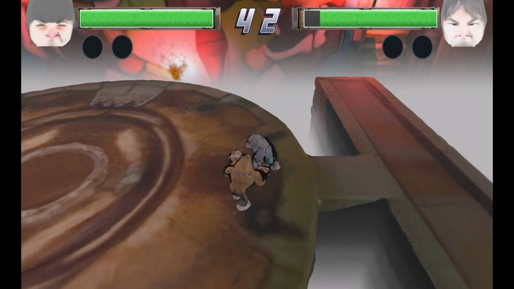
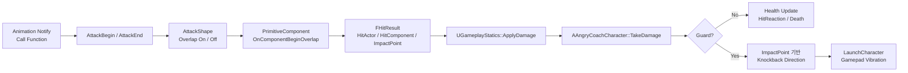
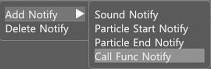
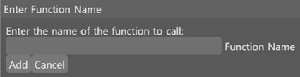

# AngryCoach - Collision Event Pipeline & Physics-based Knockback

`AngryCoach`는 custom DX11 engine 위에서 제작한 2인 로컬 대전 게임이다. 이 문서는 단순한 공격 기능 구현보다, animation notify, collision delegate, `FHitResult` damage payload, character state, physics-based knockback을 하나의 전투 판정 파이프라인으로 연결한 작업을 정리한다.

[](https://youtu.be/hjJC3KCH85E?si=zvYGZlNvb9tcTEwq)

>클릭하면 영상을 보실 수 있습니다.

## Goal

- animation timing에 맞춰 attack window를 열고 닫는다.
- weapon/accessory별 attack shape를 캐릭터 전투 판정에 연결한다.
- collision event payload를 `FHitResult` 중심으로 정리해 hit actor, hit component, impact point를 damage pipeline에 전달한다.
- guard, damage, hit reaction, death state를 character state와 animation montage에 연결한다.
- impact point 기반 knockback direction을 계산하고 `CharacterMovementComponent::LaunchCharacter`로 physics response를 적용한다.
- multi-hit 방어와 gamepad vibration으로 전투 판정의 안정성과 체감을 보강한다.

## Event Flow



## Animation-driven Attack Window

공격 판정은 animation notify에서 `AttackBegin`, `AttackEnd` 함수를 호출해 열린다. `REGISTER_FUNCTION_NOTIFY`로 캐릭터 함수를 reflection-style function map에 등록하고, `UAnimNotify_CallFunction`이 notify에 저장된 `FunctionName`을 `ProcessEvent`로 실행한다.

```cpp
#define REGISTER_FUNCTION_NOTIFY(CLASS, FUNC) \
    static struct FAutoRegister_##CLASS_##FUNC \
    { \
        FAutoRegister_##CLASS_##FUNC() \
        { \
            UClass::RegisterFunction( \
                CLASS::StaticClass(), \
                #FUNC, \
                static_cast<VoidFuncPtr>(&CLASS::FUNC) \
            ); \
        } \
    } GAutoRegister_##CLASS_##FUNC;
```

```cpp
void UAnimNotify_CallFunction::Notify(USkeletalMeshComponent* MeshComp, UAnimSequenceBase* Animation)
{
    AActor* Owner = MeshComp->GetOwner();
    if (!Owner)
    {
        return;
    }

    if (FunctionName.IsValid())
    {
        if (APawn* Pawn = Cast<APawn>(Owner))
        {
            Pawn->ProcessEvent(FunctionName);
        }
        if (AAccessoryActor* AccessoryActor = Cast<AAccessoryActor>(Owner))
        {
            AccessoryActor->ProcessEvent(FunctionName);
        }
    }
}
```

```cpp
void UObject::ProcessEvent(FName FuncName)
{
    UClass* MyClass = GetClass();
    VoidFuncPtr Func = MyClass->FindFunction(FuncName);

    if (Func)
    {
        (this->*Func)();
    }
}
```

### AnimNotify UI




UI에서 함수명을 입력하도록 하여 하드코딩을 피했다.

```cpp
if (ImGui::MenuItem("Call Func Notify"))
{
    bOpenNamePopup = true;
    memset(FunctionNameBuffer, 0, sizeof(FunctionNameBuffer));
}

if (ImGui::BeginPopupModal("Enter Function Name", NULL, ImGuiWindowFlags_AlwaysAutoResize))
{
    ImGui::Text("Enter the name of the function to call:");
    bool bEnterPressed = ImGui::InputText(
        "Function Name",
        FunctionNameBuffer,
        IM_ARRAYSIZE(FunctionNameBuffer),
        ImGuiInputTextFlags_EnterReturnsTrue
    );

    if (ImGui::Button("Add") || bEnterPressed)
    {
        UAnimNotify_CallFunction* NewNotify = NewObject<UAnimNotify_CallFunction>();
        if (NewNotify)
        {
            NewNotify->FunctionName = FName(FString(FunctionNameBuffer));
            NotifySource->AddCallFuncNotify(TimeSec, NewNotify);
        }
        ImGui::CloseCurrentPopup();
    }
}
```

## Attack Shape Binding

weapon/accessory는 attack shape를 만들고, 장착 시 캐릭터에 등록한다. 캐릭터는 등록된 shape에 overlap delegate를 바인딩해 공격 판정의 진입점을 구성한다.

```cpp
void AAccessoryActor::Equip(AAngryCoachCharacter* OwnerCharacter)
{
    for (UShapeComponent* Shape : AttackShapes)
    {
        if (Shape)
        {
            OwnerCharacter->AddAttackShape(Shape);
            Shape->SetOwner(OwnerCharacter);
        }
    }
}
```

```cpp
void AAngryCoachCharacter::AddAttackShape(UShapeComponent* Shape)
{
    if (!Shape)
    {
        return;
    }

    if (CachedAttackShapes.Contains(Shape))
    {
        return;
    }

    CachedAttackShapes.Add(Shape);
    Shape->OnComponentBeginOverlap.AddDynamic(this, &AAngryCoachCharacter::OnBeginOverlap);
}
```

attack shape는 기본적으로 overlap이 꺼진 상태로 생성된다. `AttackBegin` notify가 들어왔을 때만 overlap을 켜고, `AttackEnd`에서 다시 끈다.

```cpp
REGISTER_FUNCTION_NOTIFY(AAngryCoachCharacter, AttackBegin)
void AAngryCoachCharacter::AttackBegin()
{
    if (CurrentState == ECharacterState::Damaged ||
        CurrentState == ECharacterState::Attacking ||
        CurrentState == ECharacterState::Jumping)
    {
        return;
    }

    HitActors.Empty();
    if (CachedAttackShapes.Num() > 0)
    {
        for (UShapeComponent* Shape : CachedAttackShapes)
        {
            if (Shape)
            {
                Shape->SetGenerateOverlapEvents(true);
            }
        }
        SetCurrentState(ECharacterState::Attacking);
    }
}
```

```cpp
REGISTER_FUNCTION_NOTIFY(AAngryCoachCharacter, AttackEnd)
void AAngryCoachCharacter::AttackEnd()
{
    if (CachedAttackShapes.Num() > 0)
    {
        for (UShapeComponent* Shape : CachedAttackShapes)
        {
            if (Shape)
            {
                Shape->SetGenerateOverlapEvents(false);
            }
        }
        SetCurrentState(ECharacterState::Idle);
    }

    CurrentAttackSlot = ESkillSlot::None;
    bIsJumpAttacking = false;

    if (IsPlayingMontage())
    {
        StopCurrentMontage(0.1f);
    }
}
```

## Collision Event Payload

collision component는 overlap/hit 결과를 `FHitResult`로 큐잉하고, `OnComponentBeginOverlap` delegate에 `HitComponent`, `HitActor`, `ImpactPoint` 등을 포함한 payload를 전달한다.

```cpp
DECLARE_DELEGATE(OnComponentBeginOverlap, UPrimitiveComponent*, UPrimitiveComponent*, const FHitResult&);
DECLARE_DELEGATE(OnComponentEndOverlap, UPrimitiveComponent*, UPrimitiveComponent*, const FHitResult&);
DECLARE_DELEGATE(OnComponentHit, UPrimitiveComponent*, UPrimitiveComponent*, const FHitResult&);
```

```cpp
if (this->bGenerateOverlapEvents)
{
    FHitResult HitResult;
    if (Collision::ComputePenetration(this, Other, HitResult))
    {
        HitResult.HitComponent = Other;
        HitResult.HitActor = Other->GetOwner();
        PendingOverlaps.Add(HitResult);
        AddWorldOffset(-HitResult.ImpactNormal * HitResult.PenetrationDepth);
    }
}
```

```cpp
for (const FHitResult& HitResult : PendingOverlaps)
{
    FOverlapInfo Info;
    Info.OtherComp = HitResult.HitComponent;
    Info.OtherActor = HitResult.HitActor;

    if (ActiveOverlaps.Contains(Info))
    {
        continue;
    }

    ActiveOverlaps.Add(Info);
    OnComponentBeginOverlap.Broadcast(this, HitResult.HitComponent, HitResult);
}
```

## Damage Pipeline

`OnBeginOverlap`는 같은 attack window 안에서 같은 actor가 여러 번 맞는 것을 막기 위해 `HitActors`를 확인한다. 이후 `UGameplayStatics::ApplyDamage`를 통해 대상 actor의 `TakeDamage`로 `FHitResult`를 전달한다.

```cpp
void AAngryCoachCharacter::OnBeginOverlap(
    UPrimitiveComponent* MyComp,
    UPrimitiveComponent* OtherComp,
    const FHitResult& HitResult)
{
    if (HitActors.Contains(HitResult.HitActor))
    {
        return;
    }

    HitActors.Add(HitResult.HitActor);
    float AppliedDamage = UGameplayStatics::ApplyDamage(HitResult.HitActor, BaseDamage, this, HitResult);
}
```

```cpp
float UGameplayStatics::ApplyDamage(AActor* DamagedActor, float BaseDamage, AActor* DamageCauser,
    const FHitResult& HitResult)
{
    if (!DamagedActor || BaseDamage <= 0.0f)
    {
        return 0.0f;
    }

    if (DamagedActor == DamageCauser)
    {
        return 0.0f;
    }

    return DamagedActor->TakeDamage(BaseDamage, HitResult, DamageCauser);
}
```

## Guard and Knockback

`TakeDamage`는 character state를 기준으로 guard 여부를 분기한다. guard가 아닐 때는 체력 감소와 hit reaction을 처리하고, guard 상태에서는 damage를 0으로 만들고 impact point 기반 knockback을 적용한다.

```cpp
if (!IsGuard())
{
    ActualDamage = FMath::Min(ActualDamage, CurrentHealth);
    CurrentHealth = FMath::Max(CurrentHealth - ActualDamage, 0.0f);
    HitReation();
}
else if (bCanPlayHitReactionMontage)
{
    ActualDamage = 0.0f;
    FVector KnockbackDirection = GetActorLocation() - HitResult.ImpactPoint;
    KnockbackDirection.Z = 0.0f;

    if (KnockbackDirection.IsZero())
    {
        KnockbackDirection = -GetActorForward();
    }
    else
    {
        KnockbackDirection.Normalize();
    }

    CharacterMovement->LaunchCharacter(KnockbackDirection * KnockbackPower, true, false);
    EnableGamePadVibration();
}

if (CurrentHealth <= 0.0f)
{
    Die();
}
```

핵심은 knockback direction을 단순히 공격자의 forward vector로 고정하지 않고, `HitResult.ImpactPoint`와 피격 actor 위치 차이로 계산했다는 점이다. 이 방식은 피격 위치가 바뀌면 반응 방향도 자연스럽게 달라진다.

## Feedback and Fail-safe

피격 시 camera shake, sound, hit particle, gamepad vibration을 함께 연결해 전투 체감을 보강했다. death 처리에서는 attack shape와 capsule collision을 끄고 ragdoll로 전환한다.

```cpp
void AAngryCoachCharacter::EnableGamePadVibration()
{
    if (AController* Controller = GetController())
    {
        if (AAngryCoachPlayerController* AngryController = Cast<AAngryCoachPlayerController>(Controller))
        {
            AngryController->SetGamePadVibration(true, this, VibrationDuration);
        }
    }
}
```

```cpp
void AAngryCoachCharacter::Die()
{
    for (UShapeComponent* Shape : CachedAttackShapes)
    {
        if (Shape)
        {
            Shape->SetBlockComponent(false);
            Shape->SetGenerateOverlapEvents(false);
        }
    }

    if (CapsuleComponent)
    {
        CapsuleComponent->SetBlockComponent(false);
        CapsuleComponent->SetGenerateOverlapEvents(false);
    }

    if (SkeletalMeshComp)
    {
        SkeletalMeshComp->SetRagDollEnabled(true);
        SkeletalMeshComp->SetCollisionEnabled(ECollisionState::PhysicsOnly);
    }

    SetCurrentState(ECharacterState::Dead);
    CurrentHealth = 0.0f;
}
```

## Result & Learning

### Result

- animation notify로 attack window를 열고 닫아, 공격 판정 타이밍을 animation data와 연결했다.
- attack shape를 weapon/accessory 단위로 분리하고 character에 delegate binding해 전투 판정 흐름을 구성했다.
- `FHitResult` payload를 damage pipeline까지 전달해 hit actor, hit component, impact point를 활용할 수 있게 했다.
- `HitActors` cache로 하나의 attack window 안에서 같은 actor가 중복 피격되는 문제를 방지했다.
- guard 분기에서 damage를 막고, impact point 기반 `LaunchCharacter` knockback과 vibration feedback을 적용했다.
- death 처리에서 attack shape/capsule collision을 끄고 ragdoll physics state로 전환했다.

### Learning

- gameplay attack 구현도 engine event payload 설계가 약하면 확장하기 어렵다. `FHitResult`처럼 공통 payload를 전달해야 damage, knockback, effect를 같은 흐름에서 처리할 수 있다.
- animation notify는 단순 callback이 아니라, animation timing과 gameplay state를 연결하는 data-driven entry point로 쓸 수 있다.
- attack shape를 mesh collision과 분리하면 weapon/accessory별 판정 범위를 독립적으로 조정할 수 있다.
- physics response를 gameplay에 연결할 때는 방향 계산, 중복 hit 방지, state transition, feedback을 함께 고려해야 체감이 안정된다.

## Source References

- `Week14/Mundi/Source/Game/AngryCoachCharacter.cpp`
  - `AddAttackShape`
  - `AttackBegin`
  - `AttackEnd`
  - `OnBeginOverlap`
  - `TakeDamage`
  - `Die`
  - `EnableGamePadVibration`
- `Week14/Mundi/Source/Game/AngryCoachPlayerController.cpp`
  - gamepad vibration routing
- `Week14/Mundi/Source/Runtime/Engine/Components/AccessoryActor.cpp`
  - attack shape registration to character
- `Week14/Mundi/Source/Runtime/Engine/Components/PrimitiveComponent.h/.cpp`
  - collision delegates
  - overlap event dispatch
- `Week14/Mundi/Source/Runtime/Engine/Components/ShapeComponent.cpp`
  - `FHitResult` construction from collision query
- `Week14/Mundi/Source/Runtime/Engine/GameFramework/GameplayStatics.cpp`
  - `ApplyDamage`
- `Week14/Mundi/Source/Runtime/Engine/Animation/AnimNotify_CallFunction.cpp`
  - notify function dispatch
- `Week14/Mundi/Source/Runtime/Core/Object/ObjectMacros.h`
  - `REGISTER_FUNCTION_NOTIFY`
- `Week14/Mundi/Source/Runtime/Core/Object/Object.cpp`
  - `ProcessEvent`
- `Week14/Mundi/Source/Slate/Windows/SSkeletalMeshViewerWindow.cpp`
  - Add Notify / function name input UI
