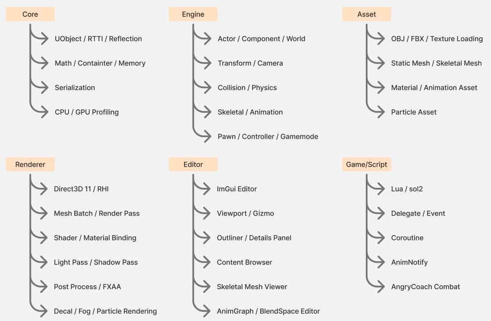

# GameTechLab Engine


`GameTechLab Engine`은 Direct3D 11 기반의 Unreal-like custom game engine입니다. 14주 동안 렌더링, 에디터, 애니메이션, 물리, 스크립팅, 게임플레이 시스템을 직접 구현하며 최종적으로 2인 로컬 대전 게임 `AngryCoach` 제작까지 연결했습니다.

이 저장소의 `main` 브랜치는 엔진 스냅샷 소개용 브랜치입니다. 주차별 구현 기록은 각 Week 브랜치에 정리되어 있으며, 아래 타임라인에서 브랜치로 이동할 수 있습니다.

> Team project note: `Weekly Development Timeline`은 팀 전체 구현 기능을 요약합니다. 개인 기여는 `My Key Contributions` 섹션에서 별도로 구분합니다.

## Tech Stack


| 구분 | 항목 |
|------|------|
| Language | C++20, HLSL (Shader Model 5.0) |
| Graphics API | Direct3D 11 |
| Physics | NVIDIA PhysX 4.1.2, NvCloth |
| Animation | FBX SDK |
| Audio | XAudio2, DirectXTK |
| UI | Dear ImGui, imgui-nodes |
| Scripting | Lua, sol2 |
| Serialization | nlohmann/json |
| Code Generation | Python (jinja2) - RTTI / Reflection / Header Tool |
| Build / Tooling | Visual Studio 2022, MSBuild, JetBrains Rider |
| Platform | Windows x64 |

## Feature Overview



| Category | Features |
|----------|----------|
| Rendering | Forward rendering, Uber shader, Ambient/Directional/Point/Spot light, Shadow Mapping, PCF/VSM, Shadow Atlas, Height Fog, Decal, Particle, Text/Billboard rendering |
| Animation | FBX import, Skeletal Mesh, CPU/GPU Skinning, Animation Sequence, State Machine, BlendSpace 1D/2D, Montage, AnimNotify|
| Physics | PhysX integration, collision shape components, overlap/hit events, ragdoll, physics asset editor, constraints, NvCloth |
| Editor | ImGui editor, multi-viewport, gizmo, outliner, property panel, asset viewer, skeletal mesh viewer, animation viewer, particle editor |
| Scripting / Gameplay | Lua scripting, delegate/event system, Pawn/Controller/GameMode, local multiplayer gameplay, damage/guard/knockback pipeline |
| Tooling | RTTI/reflection code generation, serialization, profiling, crash dump, symbol server |

## Engine Feature Map

```text
Engine
├─ Rendering
│  ├─ Direct3D 11 renderer
│  ├─ Material / shader system
│  ├─ Light and shadow pipeline
│  ├─ Decal / fog / particle
│  └─ Debug view / stats overlay
├─ Animation
│  ├─ FBX asset pipeline
│  ├─ Skeletal mesh / CPU-GPU skinning
│  ├─ Animation graph / state machine / blend space
│  └─ AnimNotify / montage
├─ Physics
│  ├─ PhysX scene integration
│  ├─ Collision shape and event dispatch
│  ├─ Ragdoll / constraint / physics asset
│  └─ cloth simulation
├─ Editor
│  ├─ ImGui-based editor panels
│  ├─ Multi-viewport and gizmo
│  ├─ Asset viewers
│  └─ Node graph / particle editor
└─ Gameplay
   ├─ Lua scripting
   ├─ Pawn / Controller / GameMode
   └─ AngryCoach combat systems
```

## Weekly Development Timeline

| Week | Main Features | Branch |
|------|---------------|--------|
| Week01 | 2D game prototype, sprite/texture loading, input, game state, score UI, sound/effect flow | [Week01][week01] |
| Week02 | Direct3D 11 3D scene viewer, primitive rendering, camera, transform gizmo, picking, outline, JSON scene I/O, ImGui panels | [Week02][week02] |
| Week03 | Actor/component editor foundation, `FName`, `UObject`/RTTI, scene manager, view/show flags, batch line, AABB, billboard/text rendering | [Week03][week03] |
| Week04 | OBJ/MTL static mesh import, material system, binary caching, `FArchive`, scene serialization, multi-viewport, `TObjectIterator` | [Week04][week04] |
| Week05 | Optimization game jam: BVH/frustum culling, hierarchical picking, local ray tests, LOD/QEM exploration, multithreading/SIMD optimization notes | [Week05][week05] |
| Week05+ | PIE mode integration, component duplication, component transform/detail UI, billboard/text component polish | [Week05+][week05-plus] |
| Week06 | Decal system, broad-phase BVH/phase logic, component picking, dynamic object serialization, Height Fog/Fake Spotlight groundwork | [Week06][week06] |
| Week06+ | SceneDepth view mode, Height Fog shader, FireBall component/pass, `RotationMovementComponent`, FXAA pass, stats/fog UI polish | [Week06+][week06-plus] |
| Week07 | Lighting expansion: Ambient/Directional/Point/Spot light, BRDF/Uber shader, normal map, shader hot reload, light debug/gizmo UI | [Week07][week07] |
| Week08 | Shadow mapping: SpotLight shadow, PCF/VSM filtering, shadow atlas/debug UI, point/directional/cube shadow work, shadow stats | [Week08][week08] |
| Week09 | Lua scripting, delegate/event system, collision components/events, Pawn/Controller/GameMode, player input, enemy/missile gameplay prototype | [Week09][week09] |
| Week09+ | Game jam polish: camera manager, spring arm, camera shake, audio engine, FXAA integration, cinematic letterbox/transition, slomo, game UI | [Week09+][week09-plus] |
| Week10 | FBX import/bake, skeletal mesh, CPU Linear Blend Skinning, skeletal mesh viewer/editor, bone visualization, material/shadow support | [Week10][week10] |
| Week11 | GPU skinning, CPU/GPU profiling, Bone AABB, animation sequence viewer, AnimNotify, animation graph/Blueprint nodes, BlendSpace 1D | [Week11][week11] |
| Week12 | Particle system/editor, sprite/mesh/beam particles, module/curve editor, particle serialization, stat overlay, crash dump/symbol server | [Week12][week12] |
| Week13 | PhysX/NvCloth expansion, physics asset editor, ragdoll, constraints, auto physics shape generation, vehicle movement, cloth/wind, DoF | [Week13][week13] |
| Week14 | `AngryCoach` local fighting game, combat/guard/jump/skill systems, hit event and damage pipeline, physics-based knockback, ragdoll, decals/particles, gamepad feedback | [Week14][week14] |

## My Key Contributions

이 섹션은 현재 대표 기여 중심으로 정리했습니다. 이후 각 주차 브랜치 README를 정리하면서 모든 주차의 개인 기여 타임라인으로 확장할 예정입니다.

| Topic | Summary | Related Branch |
|-------|---------|----------------|
| GPU Skinning & Profiling | CPU Linear Blend Skinning을 GPU skinning path로 확장하고, bone matrix `StructuredBuffer`, CPU/GPU profiling, Bone AABB bounds를 통해 연산 비용과 upload bandwidth trade-off를 분석 | [Week10][week10], [Week11][week11] |
| AngryCoach Collision Event & Hit Response | AnimNotify 기반 attack window, attack shape overlap, `FHitResult` damage payload, guard/damage/death branch, impact point 기반 knockback response를 전투 시스템에 연결 | [Week14][week14] |

### Contribution Timeline

| Week | Contribution | Keywords |
|------|--------------|----------|
| Week01 | Input/math helper, sprite JSON parsing, animation/player state setup | Input, Sprite, JSON |
| Week02 | RTTI, gizmo transform/scale, gizmo culling, outline/camera stability fixes | RTTI, Gizmo, Picking |
| Week03 | Coordinate conversion, grid/object/gizmo picking fixes, camera roll and axis color fixes | Coordinate, Editor, Gizmo |
| Week04 | OBJ/MTL/material parsing, static mesh material data, `FArchive`, binary I/O and cache freshness checks | Asset Pipeline, Serialization |
| Week05 | Frustum culling, BVH culling, visible primitive filtering | Culling, BVH |
| Week06 | Decal texture UI, decal fade in/out, `DecalComponent` tick/fade logic, depth bias polish | Decal, Editor UI |
| Week06+ | FXAA shader/pass, scene texture coordinate fixes, FX parameter controls, stats checkbox | Post Process, FXAA |
| Week07 | Directional/Point light work, color temperature, BRDF distance attenuation, light debug sprite/gizmo polish | Lighting, BRDF |
| Week08 | SpotLight shadow mapping, PCF refactor, Poisson/hardware PCF path, VSM filtering and shader macro work | Shadow Mapping, PCF, VSM |
| Week09 | Delegate/weak pointer, player input/controller, Lua collision event activation, GameMode/gameplay enemy spawn and movement AI | Gameplay Framework, Lua, Collision |
| Week09+ | Audio engine, fade in/out, game over UI credit polish | Audio, UI |
| Week10 | CPU skinning, skeletal mesh component rendering/serialization, time profiling, tangent/normal correction, parallel CPU skinning | Skinning, Profiling |
| Week11 | GPU skinning, GPU profiler, structured buffer update profiling, Bone AABB timing and bounds application | GPU Skinning, Profiling, AABB |
| Week12 | Beam particle implementation, particle editor binding, particle module refactor, Korean path handling | Particle, Editor |
| Week13 | UserData event callback refactor, skeletal mesh `PxShape` auto generation, physics asset serialization/deserialization, convex shape work | PhysX, Physics Asset |
| Week14 | Multi-hit guard, fall death, physics knockback, gamepad vibration, knockback/vibration UI exposure, decal loading path polish | Combat, Knockback, Feedback |

## Branch Links

[week01]: https://github.com/Jeongwoohyeong/GameTechLab_Engine/tree/Week01
[week02]: https://github.com/Jeongwoohyeong/GameTechLab_Engine/tree/Week02
[week03]: https://github.com/Jeongwoohyeong/GameTechLab_Engine/tree/Week03
[week04]: https://github.com/Jeongwoohyeong/GameTechLab_Engine/tree/Week04
[week05]: https://github.com/Jeongwoohyeong/GameTechLab_Engine/tree/Week05
[week05-plus]: https://github.com/Jeongwoohyeong/GameTechLab_Engine/tree/Week05%2B
[week06]: https://github.com/Jeongwoohyeong/GameTechLab_Engine/tree/Week06
[week06-plus]: https://github.com/Jeongwoohyeong/GameTechLab_Engine/tree/Week06%2B
[week07]: https://github.com/Jeongwoohyeong/GameTechLab_Engine/tree/Week07
[week08]: https://github.com/Jeongwoohyeong/GameTechLab_Engine/tree/Week08
[week09]: https://github.com/Jeongwoohyeong/GameTechLab_Engine/tree/Week09
[week09-plus]: https://github.com/Jeongwoohyeong/GameTechLab_Engine/tree/Week09%2B
[week10]: https://github.com/Jeongwoohyeong/GameTechLab_Engine/tree/Week10
[week11]: https://github.com/Jeongwoohyeong/GameTechLab_Engine/tree/Week11
[week12]: https://github.com/Jeongwoohyeong/GameTechLab_Engine/tree/Week12
[week13]: https://github.com/Jeongwoohyeong/GameTechLab_Engine/tree/Week13
[week14]: https://github.com/Jeongwoohyeong/GameTechLab_Engine/tree/Week14
