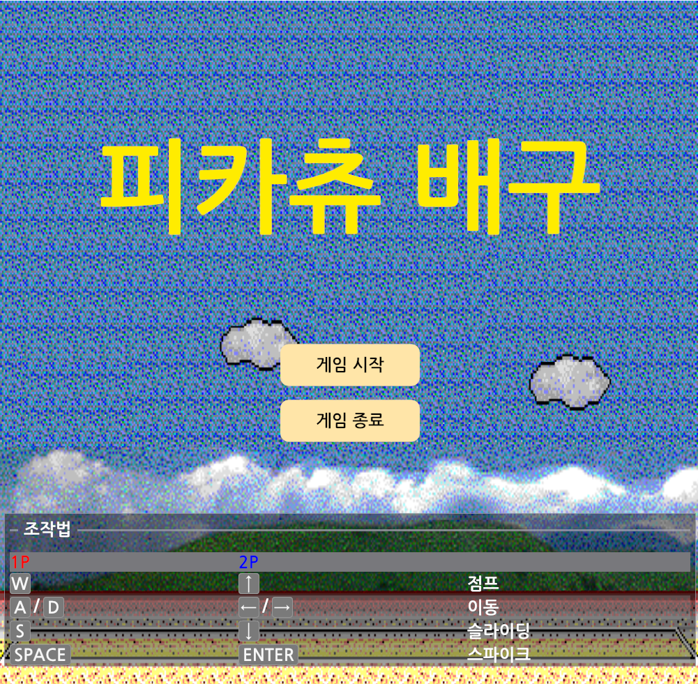
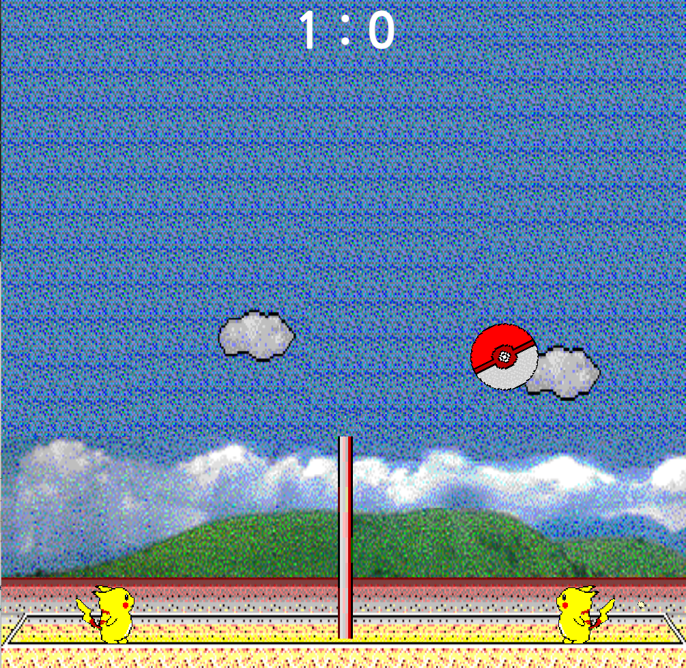
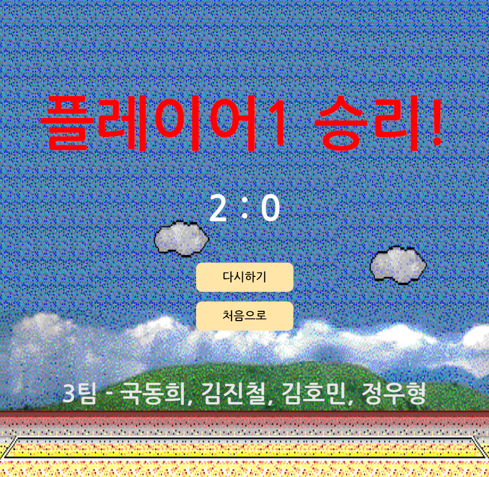

## 게임 이름 작성 ##
**1. 게임 소개**

고전 명작 미니게임 피카츄 배구를 directx11 기반으로 구현한 2D 아케이드 게임입니다. 로컬 2인 플레이로 플레이어는 피카츄가 되어 상대방과 1대1 대결을 펼치게 됩니다. 간단한 조작으로 누구나 쉽게 즐길 수 있으면서도 파고들 수록 새로운 재미를 느낄 수 있습니다.

**2. 달성한 조건**

- 시작과 끝, 재시작
  
  상태 패턴으로 메인, 플레이, 엔딩을 구분했습니다. 상태 전환 시 Enter와 Exit으로 각 상태에 필요한 오브젝트를 생성, 해제하여 시작, 종료, 재시작 흐름을 구현했습니다.
- 키보드 입력
  
  win32 api를 사용해 구현했습니다. 이전 프레임 키 상태 배열과 현재 프레임 키 상태 배열을 이용해 지속 입력(Key Down)과 순간 입력(Key Press)를 구분합니다.
- Ending Credit
  
  ImGui로 한글 지원 폰트를 로드, UTF-8 BOM 인코딩과 u8 문자열 키워드를 이용해 크레딧에 한글을 표시했습니다.
- 사운드
  
  XAudio2 API를 사용해 BGM과 SFX를 적용했습니다. .wav 파일을 로드해 헤더 확인 및 사운드 데이터를 불러왔습니다.

- UI
  
  ImGui로 UI 크기 및 색상을 조정했습니다. 시작 버튼과 스코어 표시 등 게임에 필요한 요소를 구현했습니다.
- 스프라이트

  nlohmann Json라이브러리를 이용해 Json파일을 파싱했습니다. 파싱을 통해 얻은 정보로 스프라이트 이미지를 게임 내에 적용했습니다.

- 텍스쳐

  DirectXTK 라이브러리를 사용해 이미지 파일을 로드했습니다. 피카츄, 공, 네트가 포함된 아틀라스 텍스쳐와 배경 텍스쳐를 아틀라스 쉐이더와 일반 텍스쳐 쉐이더를 제작해서 각각 적용했습니다.

**3. 게임플레이 방법**

- 조작법
  
|      | 플레이어 1   | 플레이어 2    |
|------|----------|-----------|
| 이동   | A, D     | ←,  →     |
| 점프   | W        | ↑         |
| 슬라이딩 | A, D + S | ←,  → + ↓ |
| 스파이크 | space    | enter     |
- UI

  

  
  
  

**4. 게임 규칙**

- 승리조건 : 먼저 2점을 득점하는 플레이어가 승리합니다.
- 득점 : 상대방의 진영의 바닥에 공을 떨어트리면 1점 득점합니다.
- 실점 : 자신의 진영의 바닥에 공이 닿으면 1점 실점합니다.